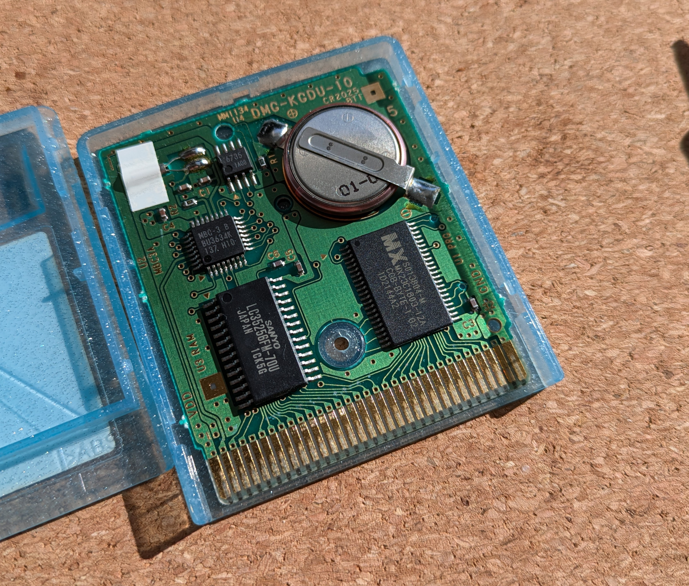
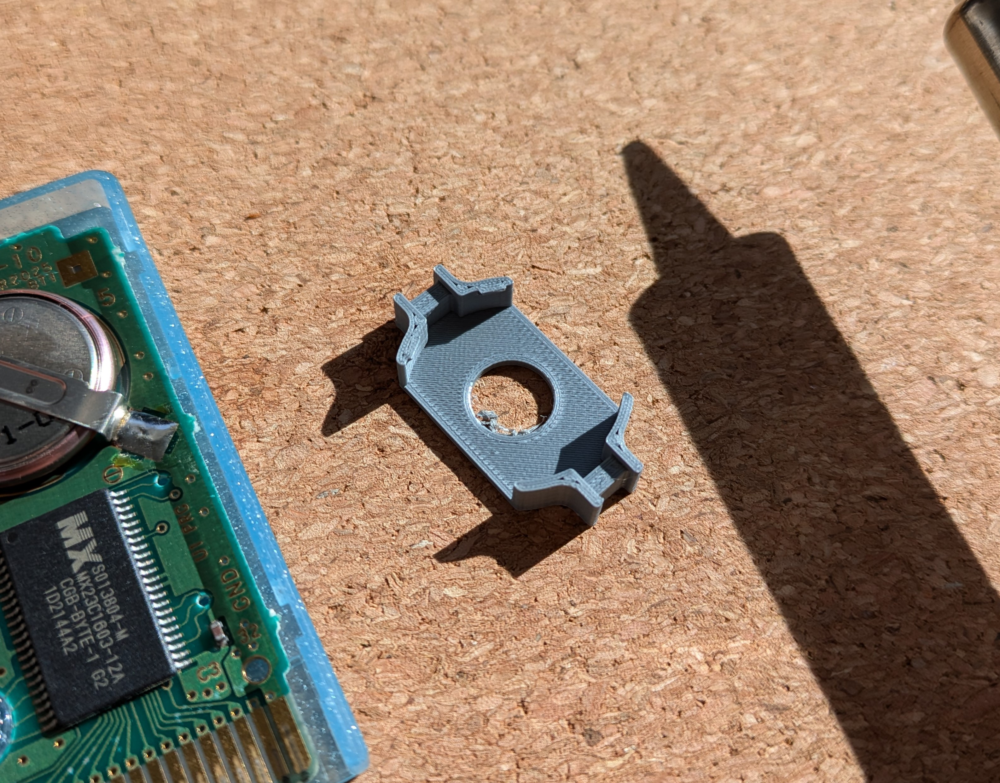
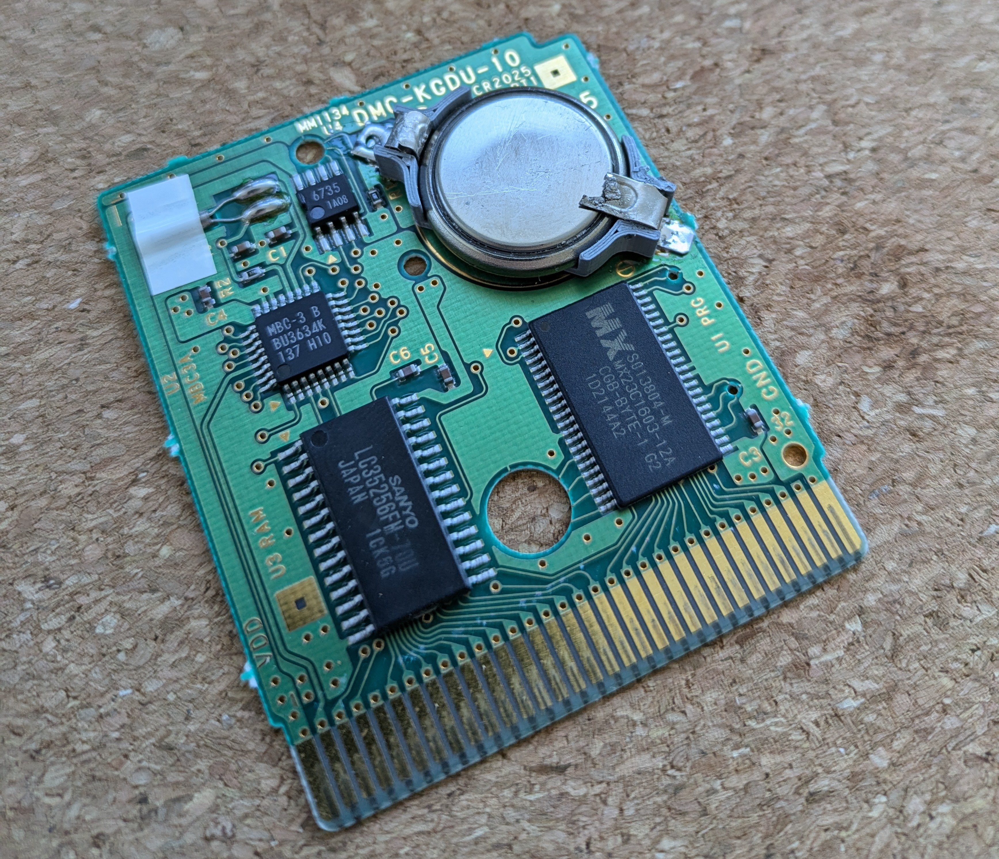

+++
date = '2024-10-15T23:05:12Z'
draft = true
title = 'Game Boy Battery Holder'
+++

## Problem

I have a copy of Pokemon Crystal with a dead battery. The battery is used to maintain the saved games, without it
saved games are lost each time you turn of the gameboy.

Replacement batteries are an option and you can buy batteries off Alibaba or Amazon for pretty cheap. Some of the 
problems with this approch were these batteries were of unknown provenance, unkown quality and usually came in bulk.

The original batteries are also somewhat special in that they have tabs spot welded to them that are used to solder 
them to the board in place of a battery holder. This means each time the battery dies you will need solder to replace it.
Granted this happens only every few years but why not make it better?

Long story short any battery that I could find that was suitable to me in terms of price and from a known brand wouldn't
ship to Canada. I found some drop in replacements on Digikey but they were under an export restriction.

## Solutions

I found some blogs where people soldered battery holders onto the gameboard and since the original battery can be replaced
by standard CR2032 batteries you can find at any hardware or electronics store you never have to order batteries online
again.

I happened to already have a CR2032 lying around because its the same battery as the one in my car key. So, I started 
looking on Digikey and other sources for battery holders. Here I ran into a common hobbiest problem, I only need one, and
while the piece rates the price isn't bad the minumum purchase quantity always makes it expensive.

Another problem I faced was that the off the shelf holders would be too thick to fit in the original case. Some others cut
holes in their cases to make room, something I did not want to do.

I decided, that I could design and 3D print my own battery holder, after all I have a printer and 3D design skills, why not?

This was the first iteration of the holder:

And here it is installed:

Notice the janky leads, I ripped the tabs off of the old battery and repurposed them as the leads for this holder. I thought
this was clever but it ended up being more janky than I was happy with.

This holder failed my requirement of fitting inside of the case, I had gotten the dimensions for a similar battery the CR2025
which is 0.7 mm thinner than a CR2032. I could have gone and found a CR2025 but I'm stubborn and wanted to make the CR2032 work.

After some trial and error I arrived at a working part for a 3D printed CR2032 holder for a gameboy cartridge.

The holder is designed to fit insided the cartridge and hold the battery without requiring any case modification. I added 
some channels on either end that would hold the leads to complete the circuit..

The leads are the jankiest part of this whole solution