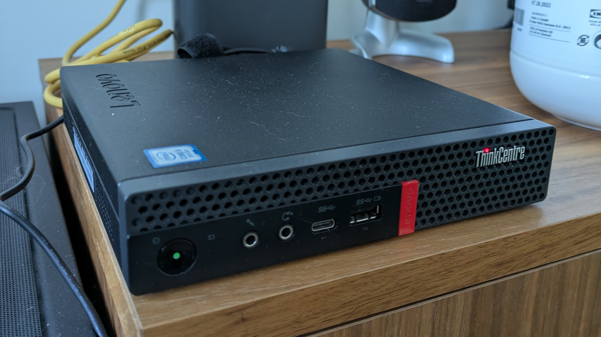

+++
date = '2026-01-23T23:05:12Z'
draft = false
title = 'Homelab'
+++

At the moment my home lab consists of a lonely Lenovo m720q mini computer.

I have proxmox installed on it and I am currently running Portainer and an LXC with a tailscale instance.

I've been using portainer to tryout self hosting and creating dev environments for other projects.

## In Progress Goals

### Host my personal website on a VM.

I am currently playing around with different ways to do this and learning as I go. I am in the process of
learning how to subdivide my network because my goal is to have this VM isolated from the rest of my network.

I got a buddy's flask application running locally (not accessible to the interet) behind an Nginx proxy.

## Next Steps

### Dev Container Everything

I will be trying to turn all my development environments into dev containers becuase I don't like poluting
my host which I use for many other things. I also want portability so I can quickly switch to my laptop
and not spend minutes to hours dealing with environment issues.

### NAS

I want to build or attach a NAS to the Homelab, problem is I really like the small form factor of the m720q
so once again I'm making my life harder, the easy solution is to buy one off the shelf but at the same time
I'm trying to minimize cost. 
