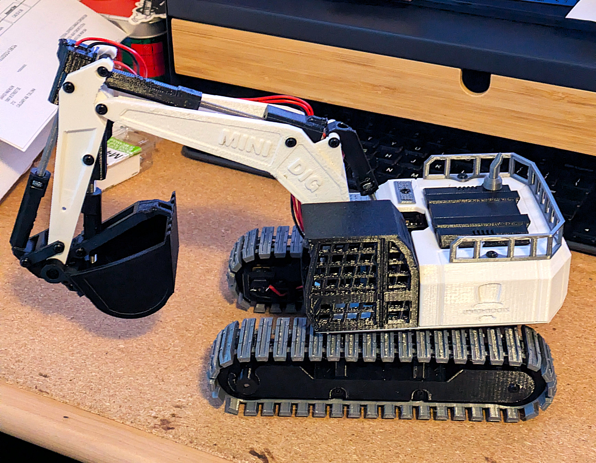
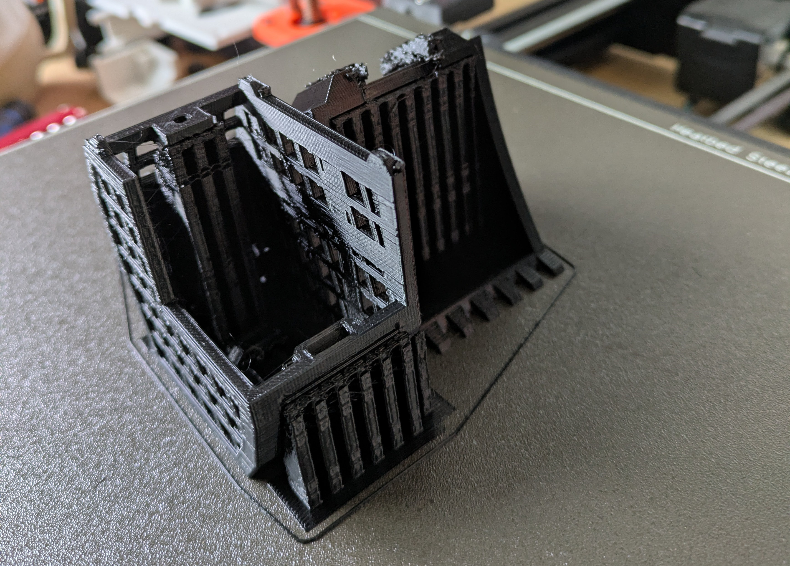
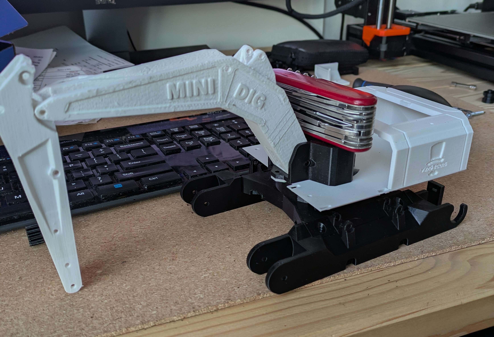
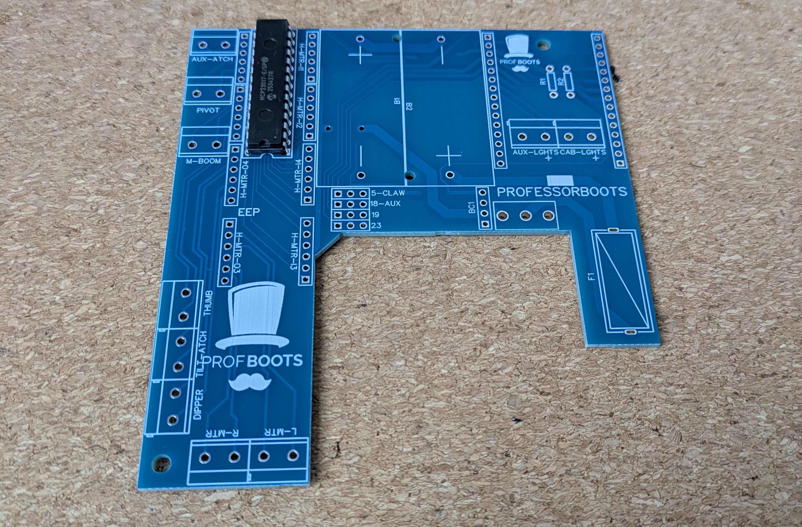
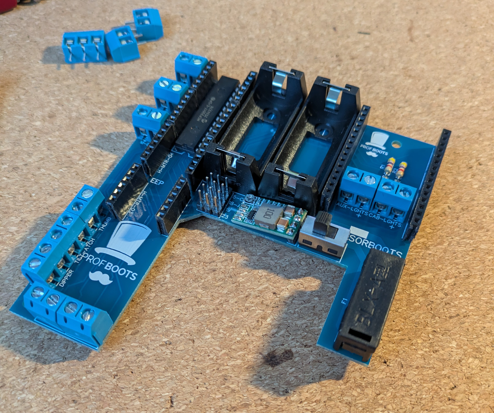
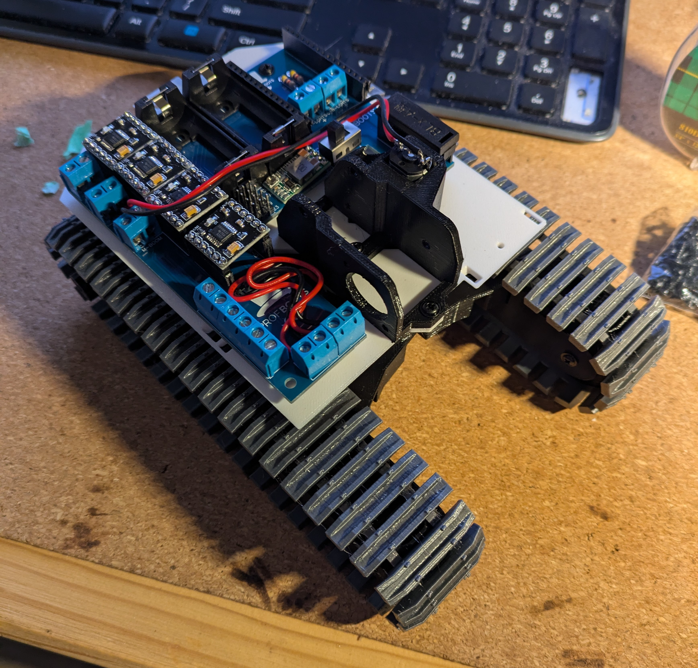

+++
date = '2025-11-15T23:05:12Z'
draft = false
title = 'Minidig Build'
+++

## Background

The Minidig model is a 3D printed RC excavator designed by [professor boots](https://professorboots.com/). The 3D model is freely availble from printables [here](https://www.printables.com/model/833291-diy-rc-excavator/files).

This was my first time printing something this substantial and also my first time working with an ESP32.
In the past I have worked with arduino's but nothing with wireless capabilities like the ESP32 and I was
excited to try it out.

## Process

Professor Boots does have a BOM and kits however they are not sold in Canada and some of the suggested
parts don't ship to Canada either. So the first step was to find my own sources for all of the components
which ended up not being to hard but took some time to find the best deal.

Like always many of these parts are sold in bulk so the cost ends up being higher than expected but now I 
have enough to maybe build another.

I 3D printed all of the plastic parts while I waited for all fo the electronic components to arrive. I estimate
the printing process took about 60-70 hrs. I did make changes to the layouts of the parts becuase I was using my
Prusa MK3s+ while Professor Boots had used a different printer. Some of the layouts also used way more supports than
I liked for my taste.

Printing the tracks was also the first time I printed TPU and it went far smoother than I expected.

Once all the parts arrived the next step was to solder the PCB and electoric components. I've done a bit of
soldering before so this step wasn't to hard for me.

Here is the board with the MCP multiplexer already solder on:

And here is the complete board with all the motor controllers, power converter, battery holders and more

The next step was to flash the ESP32 and install the code provided. Initally I bought the wrong ESP32, while it would
work technically it wouldn't fit in on the PCB or inside of the housing so keep an eye out for that if you're 
building one of these.

Following the steps provided in Professor Boots workshop was mostly sufficient for flashing the ESP32. However, I did 
have to interplote some instructions between different workshops because I wanted to use my XBox controller and not 
a PS3 controller which the code was intened for at the time. I also had to change the baud rate when writting to the 
ESP32 because the suggested rate didn't work with my particular board.

Once flashed I installed the ESP32 onto the PCB and into the base to test out the funcitonality and to check for any
issues before I went further.

The rest of the process was more of the same, assembling printed parts, routing wires and soldering electric motors. The whole
process didn't end up being to hard although there were a few finicky steps and lots of small screws to deal with.

One problem I ran into was I accidently bought 1000 rpm motors instead of 100 rpm motors for the tracks and swivel which resulted 
in the excevator behaving more like a tank however I replaced these later and it works great.

## Lessons Learned

- be careful that 3D printed supports don't fill in holes, it might be easier to reprint if this happens
- double check motor RPMs.
- use stranded wire for the motors and not solid core. I used solid because I got a deal on a multicolor box set however
  the wires very quickly fatigued and broke off from the motors at the solder joints. Professor Boots also recommends using 
  some hot glue to reinforce these joints.